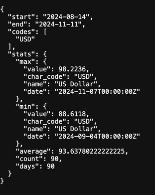

## bankstats — курсы ЦБ РФ за 90 дней

HTTP-сервис забирает курсы валют ЦБ РФ за 90 календарных дней, заканчиваясь указанной датой end, и возвращает сводку:

1) максимальный курс (RUB за 1 единицу), валюту и дату

2) минимальный курс, валюту и дату

3) среднее значение курса по всем валютам за период

Cтарт:
```bash 

git clone https://github.com/1rd0/BankStats.git
cd  BankStats
docker compose up --build -d
 ```
Проверка:
```bash 

curl 'http://localhost:8080/stats?end=2024-11-11&codes=USD'
 ```
<p align="center">
 
</p>

## Для стабильности запросов:

1) при HTTP 403 выполняется фолбэк https → http

2) между днями есть небольшая задержка  

Поле Value парсится с поддержкой точек/запятых.

Значения нормализуются на 1 единицу валюты: PerUnit = Value / Nominal.
